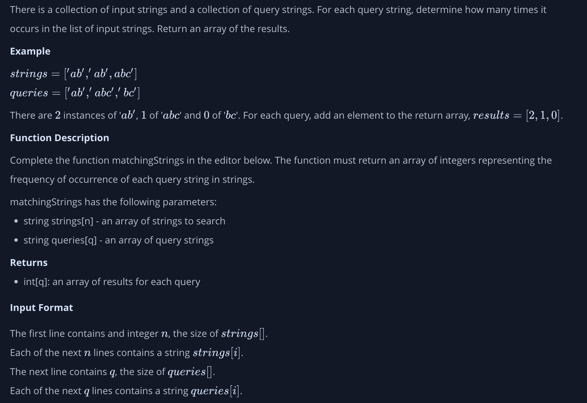
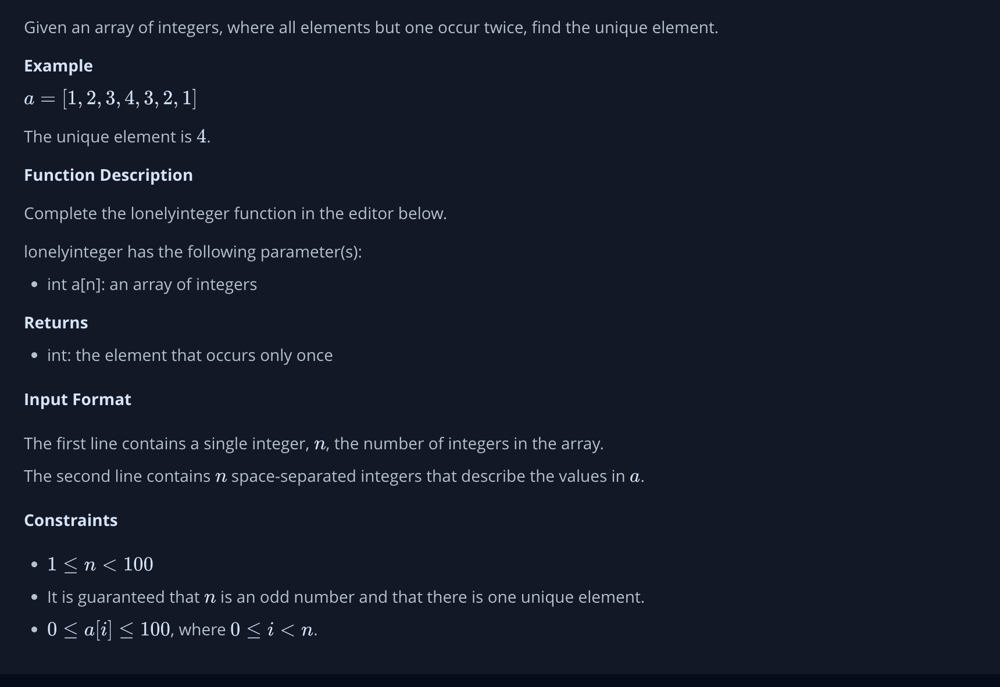
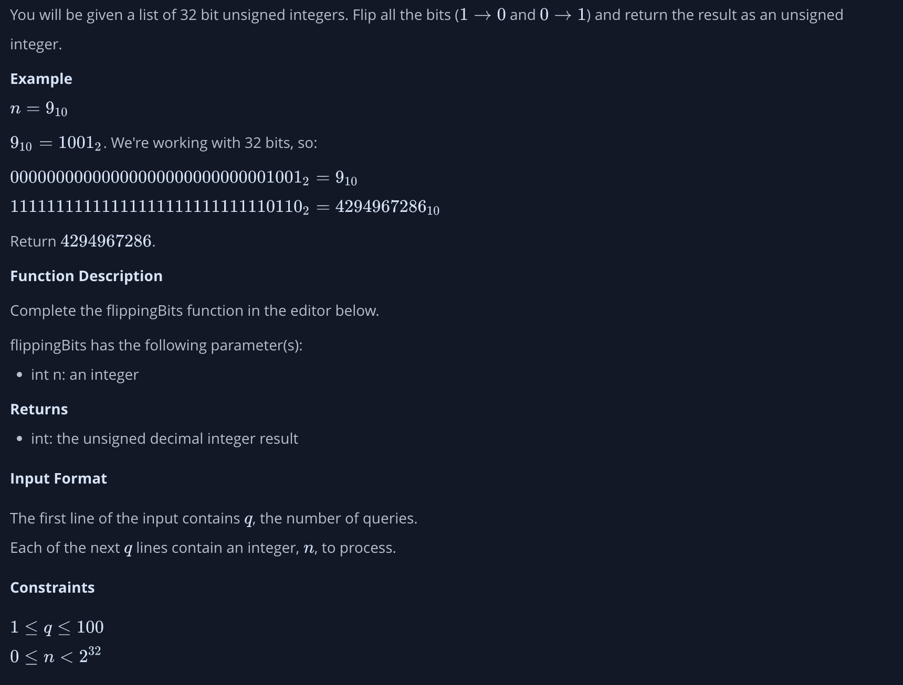
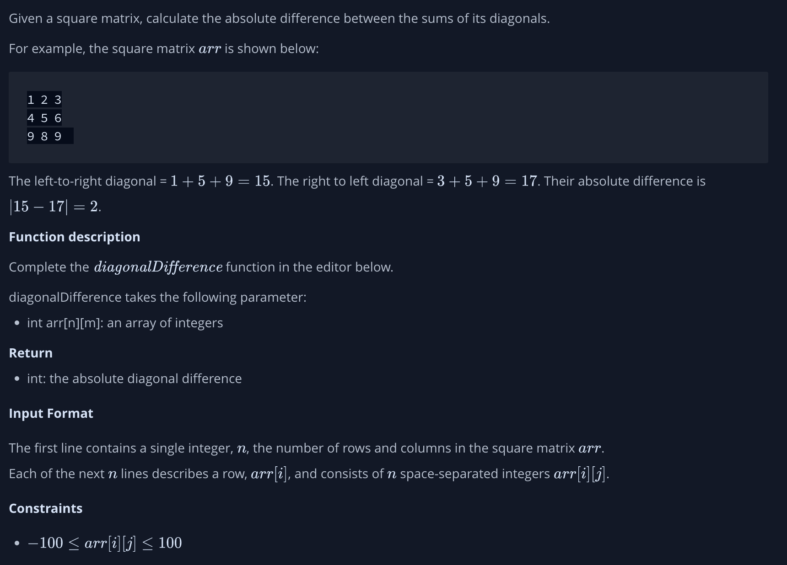
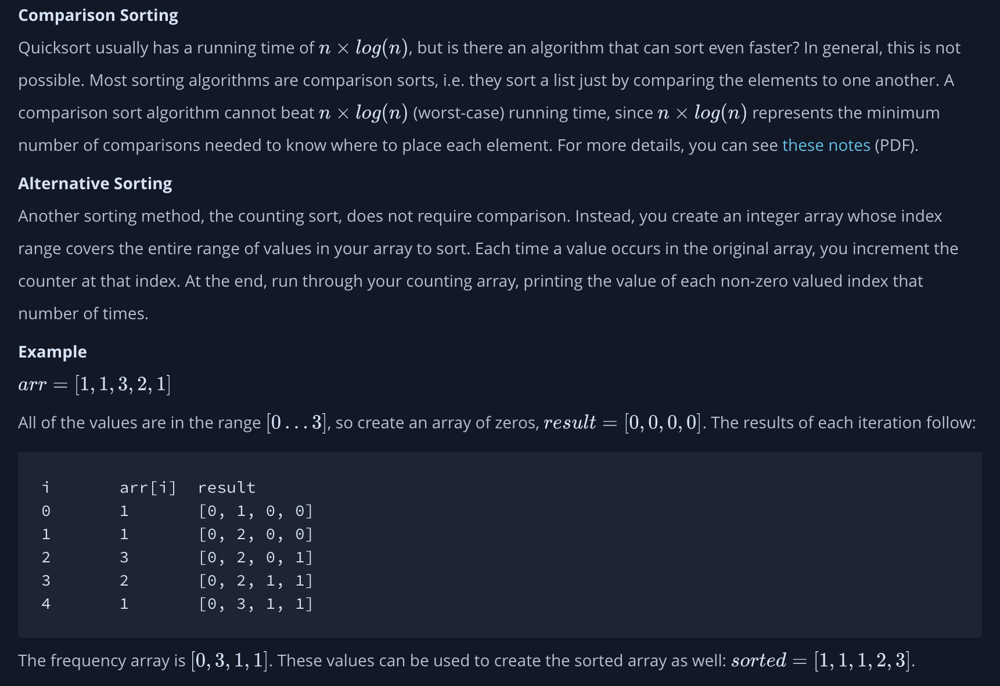
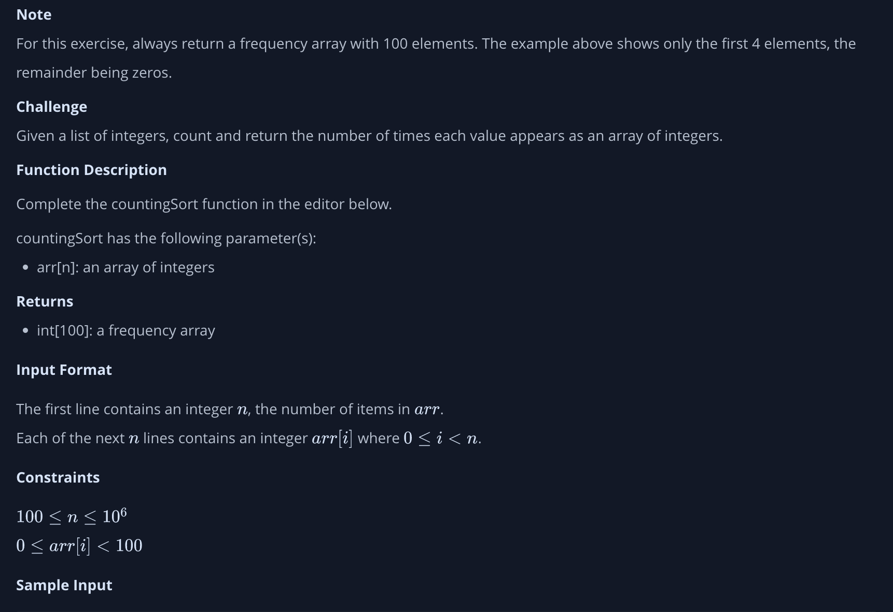
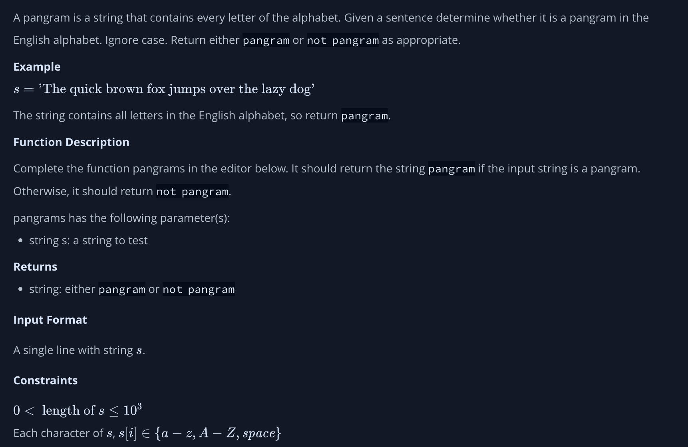
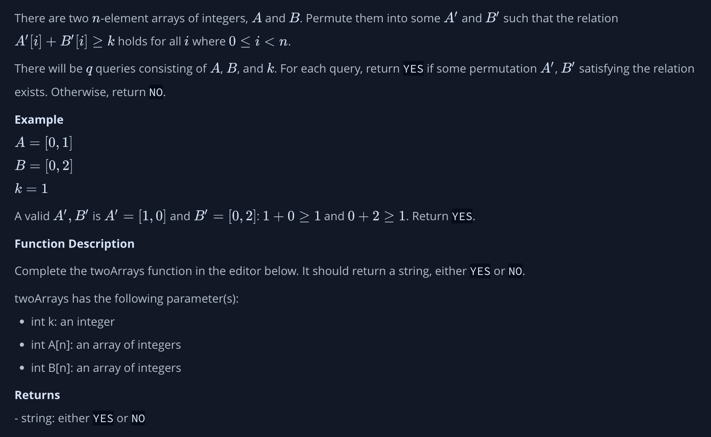

# Instructions for Week One Problems 

### Plus Minus

### Matching Strings

### Lonely Integer

### Flipping Bits 

### Diagonal Difference 

### Counting Sort 

### Pangrams

### Permuting Two Arrays 

